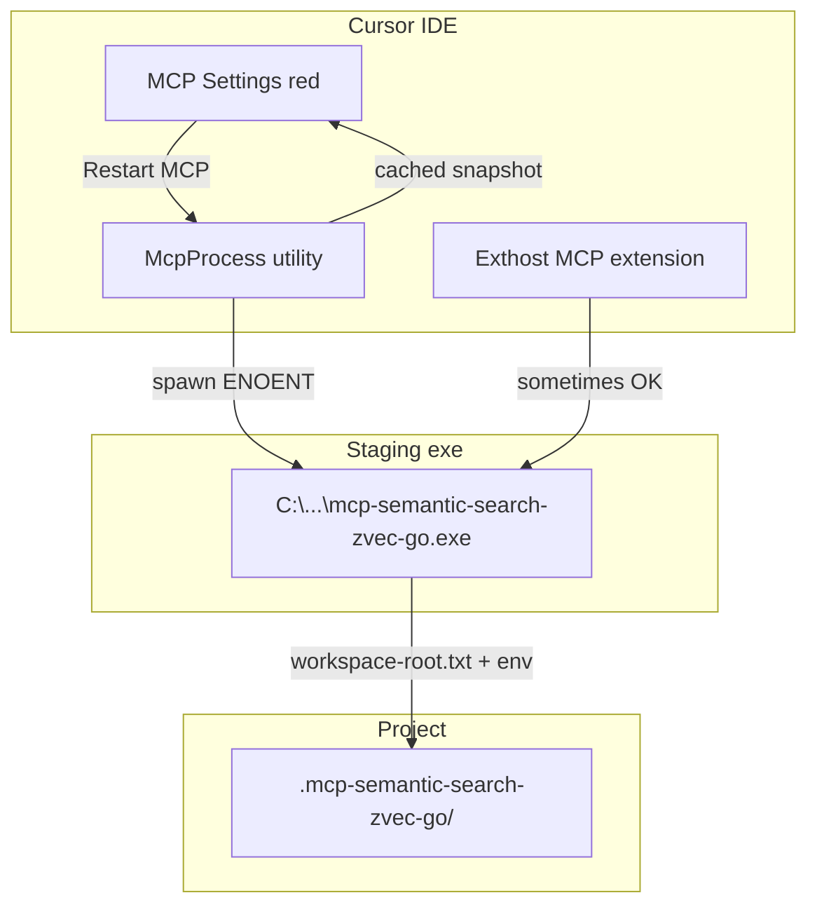

# Upstream: проблема MCP на Windows и что исправить

## Принятое решение (реализовано)

**Отказ от `%LOCALAPPDATA%` staging.** Exe, DLL и launcher-скрипты — только в `.mcp-semantic-search-zvec-go/bin/` проекта. Cursor запускает MCP через `powershell.exe -File ...\run-mcp-stdio.ps1` с полным `env` (`WORKSPACE_ROOT`, `INDEX_DIR`, `CONFIG_PATH`, …). См. [`templates/cursor-mcp-windows.fragment.json`](../templates/cursor-mcp-windows.fragment.json), [`scripts/install/install.ps1`](../scripts/install/install.ps1).

Uninstall удаляет legacy staging из старого manifest (`cursor_staging_dir`), если остался от предыдущих версий.

---

## Контекст инцидента

Проект: `D:\root\ForAgents\Тест установки семант поиска` (кириллица в пути).  
Cursor 3.7.36, native install через [`scripts/install/install.ps1`](D:/root/clouds/YandexDisk/30_Dev/repo/MCP/mcp-semantic-search-zvec-go/scripts/install/install.ps1).

Симптом: MCP **error**, tools=0, хотя `mcp-semantic-search-zvec-go.exe --version` из PowerShell/Node работает.



---

## Корневые причины (3 слоя)

### 1. Баг/ограничение Cursor (не в Go-коде)

**McpProcess utility не может spawn-ить exe** — в `%APPDATA%\Cursor\logs\*\mcpprocess.log`:

```
Connection failed: spawn C:\Users\...\mcp-semantic-search-zvec-go.exe ENOENT
Connection failed: spawn D:\mcp-launch\...\mcp-semantic-search-zvec-go.exe ENOENT
Connection failed: spawn C:\WINDOWS\system32\cmd.exe ENOENT
```

Файл существует, Node `child_process.spawn` успешен — падает только **utility-процесс Cursor** (`mcpProcessMain`, PID жил с 20:55 до принудительного kill в 00:20).

**Кэш non-retryable error** — после серии ENOENT Cursor перестаёт подключаться:

```
Skipping automatic createClient for non-retryable error server
```

Restart MCP / Reload Window **не сбрасывает** snapshot; помогает смена ключа сервера в `mcp.json` или полный перезапуск Cursor + kill McpProcess.

**Гонка при открытии окна** — exthost успел spawn-нуть Go-сервер, но соединение оборвалось:

```
DeleteClient reason: mcp_process_client_factory_changed
CreateClient completed connected=false
```

**Известный баг `${workspaceFolder}` + Unicode** — уже описан в [`docs/INSTALL.md`](D:/root/clouds/YandexDisk/30_Dev/repo/MCP/mcp-semantic-search-zvec-go/docs/INSTALL.md) (строки 106–108); staging в ASCII-path как обход.

---

### 2. Пробелы в upstream install (исправляемо в репозитории)

#### 2a. Неполный `env` в `.cursor/mcp.json`

[`Merge-WindowsMcpJson`](D:/root/clouds/YandexDisk/30_Dev/repo/MCP/mcp-semantic-search-zvec-go/scripts/install/install.ps1) (строки 125–131) пишет только:

```powershell
env = [ordered]@{
    AUTO_INDEX_ON_START = "true"
}
```

Linux-шаблон [`templates/cursor-mcp.fragment.json`](D:/root/clouds/YandexDisk/30_Dev/repo/MCP/mcp-semantic-search-zvec-go/templates/cursor-mcp.fragment.json) содержит полный набор: `WORKSPACE_ROOT`, `WORKSPACE_ID`, `INDEX_DIR`, `CONFIG_PATH`.

**Риск:** если `WorkspaceRootFromExecutable()` не прочитает `workspace-root.txt` (сбой `os.Executable()`, cwd ≠ проект), [`ResolveWorkspaceRoot`](D:/root/clouds/YandexDisk/30_Dev/repo/MCP/mcp-semantic-search-zvec-go/internal/config/install_root.go) падает на `getwd()` — индексируется **не тот каталог** (в логах был путь к clone репозитория Go, а не целевой проект).

**Upstream fix:** в `Merge-WindowsMcpJson` и `Merge-WindowsMcpJsonProxy` добавить явные env с **абсолютными путями** (backslash-only):

```json
"WORKSPACE_ROOT": "D:\\...\\project",
"WORKSPACE_ID": "...",
"INDEX_DIR": "...\\.mcp-semantic-search-zvec-go\\data\\index",
"CONFIG_PATH": "...\\.mcp-semantic-search-zvec-go\\config.yaml"
```

Не полагаться только на `workspace-root.txt`.

#### 2b. Единственный staging-каталог: `%LOCALAPPDATA%`

[`Install-WindowsCursorStaging`](D:/root/clouds/YandexDisk/30_Dev/repo/MCP/mcp-semantic-search-zvec-go/scripts/install/install.ps1) (строка 83):

```powershell
$stagingRoot = Join-Path $env:LOCALAPPDATA "mcp-semantic-search-zvec-go\cursor\$InstallId"
```

При зависшем McpProcess spawn из `%LOCALAPPDATA%` тоже давал ENOENT. Workaround пользователя: **`C:\mcp-launch\{installId}\`**.

**Upstream fix:**
- Параметр `-StagingRoot` (default: `%LOCALAPPDATA%\...`, fallback/alternate: `C:\mcp-launch\{id}`).
- Или env `MCP_STAGING_ROOT` для переопределения.
- Записывать выбранный путь в `install-manifest.json` → `cursor_staging_dir`.

#### 2c. Forward slashes в Windows-путях

В логах Cursor при ручной правке / Linux-шаблоне:

```
spawn D:\root\ForAgents\...\Тест.../.mcp-semantic-search-zvec-go/bin/... ENOENT
```

Смешение `\` и `/` ломает spawn в McpProcess.

**Upstream fix:**
- Функция `Normalize-WindowsPath` — все пути в `command` и `env` только с `\`.
- Windows-шаблон [`templates/cursor-mcp-windows.fragment.json`](новый) — отдельно от Linux-fragment с `/`.
- Запретить использование `cursor-mcp.fragment.json` (с `/`) в `install.ps1` на Windows.

#### 2d. Недостаточный troubleshooting в docs

[`AGENTS.md`](D:/root/clouds/YandexDisk/30_Dev/repo/MCP/mcp-semantic-search-zvec-go/AGENTS.md) (строка 86) советует только «re-run install + Restart MCP» — **недостаточно** для:
- зависшего McpProcess;
- non-retryable snapshot;
- переноса проекта OneDrive → `D:\...`.

**Upstream fix:** расширить таблицу Troubleshooting + новый раздел в [`docs/INSTALL.md`](D:/root/clouds/YandexDisk/30_Dev/repo/MCP/mcp-semantic-search-zvec-go/docs/INSTALL.md) «Windows / Cursor MCP».

---

### 3. Go-сервер (низкий приоритет)

Сервер **не был** главной причиной red MCP: до handshake процесс часто не доходил.  
Единичная ошибка в `server.log`:

```
mcp: invalid character 'ï' ...  // UTF-8 BOM от PowerShell pipe
mcp: invalid character 'C' ...  // Content-Length framing в ручном тесте
```

Cursor шлёт корректный JSON-RPC. Опционально: strip BOM в stdio reader — только для устойчивости к dev-тестам, не blocker.

---

## Рекомендуемые изменения в upstream

### A. `scripts/install/install.ps1`

| Изменение | Зачем |
|-----------|-------|
| `Merge-WindowsMcpJson`: полный `env` с абсолютными путями | Не зависеть от cwd / `workspace-root.txt` |
| `-StagingRoot` / `C:\mcp-launch` как опция | Обход ENOENT McpProcess |
| `Normalize-WindowsPath` для command и env | Убрать mixed slashes |
| После update: `-Force` copy staging + проверка `Test-Path` | Явная ошибка если exe не скопирован |
| Bump `install-manifest.json`: поле `staging_strategy` | Диагностика |

### B. Шаблоны

- Новый `templates/cursor-mcp-windows.fragment.json` — backslashes, без `${workspaceFolder}` в `command`.
- Комментарий в `cursor-mcp.fragment.json`: «Linux/macOS only».

### C. Документация

Новый subsection **«Cursor MCP error на Windows»** в INSTALL.md / AGENTS.md:

1. Проверка: `exe --version` из PowerShell.
2. Лог: `%APPDATA%\Cursor\logs\<session>\mcpprocess.log` — искать `spawn ... ENOENT`, `non-retryable`.
3. Fix ladder:
   - re-run `install.ps1 -TargetRoot ...`
   - `-StagingRoot C:\mcp-launch` (если добавлен параметр)
   - kill McpProcess / полный restart Cursor
   - сменить ключ сервера в `mcp.json` (сброс snapshot)
   - Developer: Reload Window
4. После **переноса проекта** — обязательно re-run install (обновить staging + `workspace-root.txt` + env).

### D. Smoke-тест

Расширить [`scripts/smoke/run-mcp-staging-multi-windows.ps1`](D:/root/clouds/YandexDisk/30_Dev/repo/MCP/mcp-semantic-search-zvec-go/scripts/smoke/run-mcp-staging-multi-windows.ps1):

- Проверка что пути в `.cursor/mcp.json` без `/`.
- Проверка наличия `WORKSPACE_ROOT` в env.
- Опционально: подсказка «grep mcpprocess.log for ENOENT».

---

## Что НЕ является багом upstream

| Наблюдение | Ответственность |
|------------|-----------------|
| ENOENT при живом exe в McpProcess | Cursor utility process |
| non-retryable error после failures | Cursor MCP snapshot store |
| `mcp_process_client_factory_changed` race | Cursor |
| LM Studio не запущен | Конфиг пользователя (`active_profile`), не блокирует MCP start |

---

## Краткий текст для PR/issue upstream

**Title:** Windows Cursor MCP: полный env в mcp.json, альтернативный staging root, troubleshooting ENOENT

**Problem:** На Windows с кириллицей в пути проекта Cursor McpProcess падает с `spawn ... ENOENT` для staging exe; install.ps1 записывает неполный env и полагается только на workspace-root.txt; docs не описывают kill McpProcess и сброс non-retryable snapshot.

**Fix:** Explicit WORKSPACE_ROOT/INDEX_DIR/CONFIG_PATH in Merge-WindowsMcpJson; optional C:\mcp-launch staging; backslash-normalized paths; expanded troubleshooting + smoke checks.

---

## Workaround для пользователей (до merge upstream)

Уже применён локально:

- Staging: `C:\mcp-launch\ced51a625a23\`
- [`mcp.json`](D:/root/ForAgents/Тест установки семант поиска/.cursor/mcp.json): полный env + ключ `zvec-semantic-search`
- Kill зависшего McpProcess (PID из `mcpprocess.log`)

После upstream-fix достаточно будет `install.ps1 -TargetRoot ...` без ручных правок.
