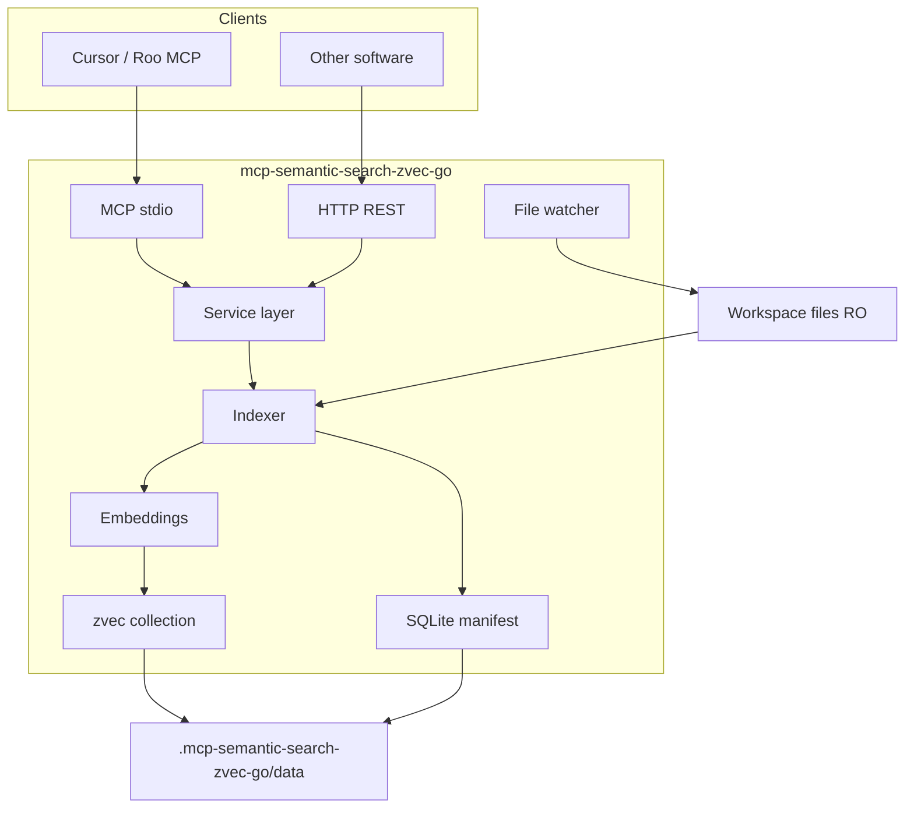

# Architecture

## Overview



## Design principles

1. **Single service layer** — `internal/service` shared by MCP and HTTP; identical JSON semantics.
2. **Embedded vector store** — zvec in-process; no external DB server.
3. **Resilience first** — graceful shutdown, lock recovery, health/readiness probes.
4. **Two deployment modes** — per-project (default) and shared daemon.

## Deployment modes

### Mode A — Per-project (default)

One OS process bound to one `WORKSPACE_ROOT`. Each target project has `.mcp-semantic-search-zvec-go/` with its own index.

- Full isolation of locks, watchers, crashes.
- Cursor: one MCP entry per project in `.cursor/mcp.json`.
- Trade-off: N projects → N processes (N × ONNX memory in local mode).

### Mode B — Shared daemon

One long-running HTTP server serves multiple workspaces via `workspace_id`.

- `daemon.yaml` registers workspaces: `id`, `root`, `index_dir`, `config_path`.
- HTTP: header `X-Workspace-ID` or JSON/query field `workspace_id`.
- `internal/daemon.WorkspaceRegistry` with LRU eviction (`max_open_workspaces`).
- MCP: thin `--stdio-proxy --workspace-id=... --daemon-url=...` for Cursor.
- CLI: `--daemon --daemon-config daemon.yaml` starts HTTP only; no per-project stdio cleanup.

### Registry lifecycle

`internal/daemon.WorkspaceRegistry` lazy-opens workspaces on first request (cold-open). Concurrent opens for the same `workspace_id` share one two-phase init (`config` → `phase1` service). `BorrowService` tracks in-flight HTTP handlers; LRU eviction waits until `refs` drain.

`Close()` sets `closing`, cancels the registry context, drains borrows and cold-opens (default 30 s), then closes idle handles and shuts down the zvec runtime. While closing, new `BorrowService` calls return `ErrRegistryClosing` → HTTP **503** `registry is closing`.

## Package layout

| Package | Role |
|---------|------|
| `cmd/mcp-semantic-search-zvec-go` | CLI entry, signal handling |
| `internal/transport/mcp` | MCP stdio (go-sdk) |
| `internal/transport/http` | REST v1, `/health`, `/ready` |
| `internal/service` | Core API |
| `internal/indexer` | Scan, chunk, background jobs |
| `internal/embeddings` | `openai_compatible`, `onnx` |
| `internal/store/zvec` | zvec-go wrapper |
| `internal/store/manifest` | SQLite per-file manifest |
| `internal/lock` | Cross-process `index.lock` |
| `internal/watcher` | fsnotify + polling |
| `internal/config` | YAML + env |
| `internal/daemon` | Multi-tenant registry |

## Data layout

```
.mcp-semantic-search-zvec-go/
├── config.yaml
├── bin/mcp-semantic-search-zvec-go[.exe]
├── models/                    # ONNX model bundles
├── logs/
│   ├── server.log
│   └── mcp.log
└── data/
    ├── index/
    │   ├── manifest.db
    │   ├── index_meta.json    # workspace owner fingerprint
    │   ├── index.lock
    │   ├── stdio.lock
    │   └── zvec/ws_<hash>/
```

### index_meta.json

Binds index to one workspace via `WORKSPACE_ID` / `workspace_fingerprint`. Mismatch from another project blocks writes to prevent manifest/zvec mixing.

### index.lock

- OS advisory exclusive lock (`flock` on Unix, `LockFileEx` on Windows) on an open fd for the holder's lifetime.
- Content: `PID` + start time + heartbeat (diagnostics, `HolderPID` / `LiveHolder`); format unchanged from earlier versions.
- `LiveHolder`: returns PID only when that process is alive and matches the identity recorded in the lock file (guards against stale or reused PIDs).
- `TryAcquire`: reclaims orphaned lock files first, then open `O_CREATE|O_RDWR`, non-blocking exclusive lock; no `O_EXCL` / TOCTOU reclaim.
- `ReclaimStale`: open + non-blocking lock; if acquired, file is orphaned (holder crashed) → remove.
- `lock_stale_seconds` / `isStale()` retained for maintenance diagnostics only (uninstall, legacy files).
- `heartbeat_seconds` is deprecated for mutual exclusion; indexing no longer calls `Heartbeat`.

### stdio.lock

- Acquired at `--stdio` startup in `PrepareStdio` (per workspace `INDEX_DIR`).
- Ensures only one native MCP stdio process serves a project index at a time.
- Before acquire: `stopStaleStdioInstances` kills prior `--stdio` processes matched by workspace path (case-insensitive on Windows) or `bin/workspace-root.txt`; orphaned `stdio.lock` files are reclaimed when the OS lock is released.
- Lock diagnostics use `LiveHolder` (alive PID + start-time match), not raw `HolderPID` alone.
- Windows GUI detects a competing MCP via `FindStdioForWorkspace` (process scan for `--stdio` + workspace), then `LiveHolder` as fallback; stale lock payloads are not shown to the user.
- If acquire fails after retries, process exits with a clear stderr hint (Cursor may show MCP error briefly — preferred over broken search).
- Released on normal shutdown.

## Resilience

| Mechanism | Purpose |
|-----------|---------|
| Idempotent zvec open | Avoid double-open LOCK errors |
| SIGTERM handler | Close collection, remove lock |
| stdio client disconnect | Exit process after MCP session ends (`awaitTransportResults`); cancels ctx and stops file watcher |
| stdio parent watch | Exit when a stdio launch-chain ancestor (`powershell`/`cmd` or Cursor) dies |
| Stale process cleanup | `internal/lifecycle` kills prior `--stdio` instance by exe + workspace path on startup |
| stdio.lock singleton | Block second `--stdio` process for same workspace |
| zvec lock recovery | On LOCK error: kill duplicate stdio, close handle, retry open (`SemanticSearch`, `index_status`) |
| Partial search during write | `indexing` metadata in search response; `/ready` stays not-ready until idle |
| `/health` vs `/ready` | Liveness vs embeddings+index loaded |
| Polling file watcher | Windows Docker bind-mount compatibility |
| Request context | MCP/HTTP pass `ctx` to sync service calls (search, status, ready); embeddings honor cancel |
| Indexing lifecycle | Background `Coordinator.run` uses process/workspace ctx; stops on shutdown/eviction, not on reindex client disconnect |

## Security

- Workspace mounted read-only in Docker.
- HTTP `API_TOKEN` Bearer auth (constant-time compare). When unset, the API is
  unauthenticated and a warning is logged on startup — loudly if the listen
  address is non-loopback (network-reachable). Per-project `--http` defaults to
  loopback (`127.0.0.1:8080`); daemon/Docker default `:8080`. Bind to
  `127.0.0.1` or set a token for network exposure.
- Shared daemon **open mode** (no `API_TOKEN`): `GET /v1/status`, `POST /v1/search`,
  and `POST /v1/reindex` redact workspace path fields and sanitize path-bearing
  messages (see [API.md — Open daemon redaction](API.md#open-daemon-redaction)).
- `GET /v1/workspaces` returns only workspace `id` and `open` by default; absolute
  paths from `daemon.yaml` require `?include_paths=1` **and** a valid Bearer token
  (`401` when token is unset or header missing/invalid).
- Secrets from `.env` (anything matching `*TOKEN*`, `*SECRET*`, `*PASSWORD*`,
  `*API_KEY*`, `*CREDENTIAL*`) are loaded into a private in-memory map and are
  **not** exported to the process environment (`os.Setenv`), so they don't leak
  via `/proc/<pid>/environ` or to child processes. Plaintext `api_key` in
  `config.yaml` is discouraged and logs a warning — prefer `api_key_env` + `.env`.
- Index contains source snippets — keep `data/` out of git; `data/` and `logs/`
  are created with `0700`/`0600` permissions.
- Default embeddings via local HTTP need no cloud API keys.

## Versioning

- Go module + `internal/version.Version`
- Git tags `v*`, GitHub Releases with cross-compiled binaries
- Docker: `ghcr.io/1CSerg/mcp-semantic-search-zvec-go:<semver>`
