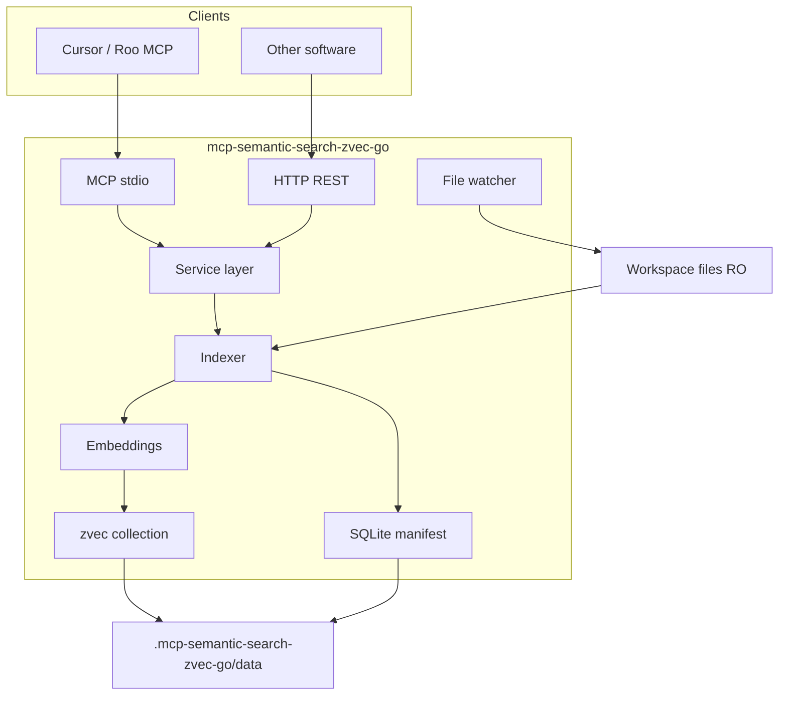

# Architecture

## Overview



## Design principles

1. **Single service layer** — `internal/service` shared by MCP and HTTP; identical JSON semantics.
2. **Embedded vector store** — zvec in-process; no external DB server.
3. **Resilience first** — graceful shutdown, lock recovery, health/readiness probes.
4. **Two deployment modes** — per-project (default) and shared daemon (Phase 5).

## Deployment modes

### Mode A — Per-project (default)

One OS process bound to one `WORKSPACE_ROOT`. Each target project has `.mcp-semantic-search-zvec-go/` with its own index.

- Full isolation of locks, watchers, crashes.
- Cursor: one MCP entry per project in `.cursor/mcp.json`.
- Trade-off: N projects → N processes (N × ONNX memory in local mode).

### Mode B — Shared daemon (Phase 5)

One long-running HTTP server serves multiple workspaces via `workspace_id`.

- `daemon.yaml` registers workspaces: `id`, `root`, `index_dir`, `config_path`.
- HTTP: header `X-Workspace-ID` or JSON/query field `workspace_id`.
- `internal/daemon.WorkspaceRegistry` with LRU eviction (`max_open_workspaces`).
- MCP: thin `--stdio-proxy --workspace-id=... --daemon-url=...` for Cursor.
- CLI: `--daemon --daemon-config daemon.yaml` starts HTTP only; no per-project stdio cleanup.

## Package layout

| Package | Role |
|---------|------|
| `cmd/mcp-semantic-search-zvec-go` | CLI entry, signal handling |
| `internal/transport/mcp` | MCP stdio (go-sdk) |
| `internal/transport/http` | REST v1, `/health`, `/ready` |
| `internal/service` | Core API |
| `internal/indexer` | Scan, chunk, background jobs (Phase 2) |
| `internal/embeddings` | `openai_compatible`, `onnx` (Phase 1/4) |
| `internal/store/zvec` | zvec-go wrapper |
| `internal/store/manifest` | SQLite per-file manifest |
| `internal/lock` | Cross-process `index.lock` |
| `internal/watcher` | fsnotify + polling |
| `internal/config` | YAML + env |
| `internal/daemon` | Multi-tenant registry (Phase 5) |

## Data layout

```
.mcp-semantic-search-zvec-go/
├── config.yaml
├── bin/mcp-semantic-search-zvec-go[.exe]
├── models/                    # ONNX bundles (Phase 4)
└── data/
    ├── index/
    │   ├── manifest.db
    │   ├── index_meta.json    # workspace owner fingerprint
    │   ├── index.lock
    │   └── zvec/ws_<hash>/
    └── logs/
        ├── server.log
        └── mcp.log
```

### index_meta.json

Binds index to one workspace via `WORKSPACE_ID` / `workspace_fingerprint`. Mismatch from another project blocks writes to prevent manifest/zvec mixing.

### index.lock

- Exclusive create when indexing starts (`O_CREAT|O_EXCL`).
- Content: PID + Unix timestamp; heartbeat updates mtime.
- Stale reclaim: dead PID, empty file, or age > `lock_stale_seconds`.
- Read paths (`search`, `status`) reclaim stale locks so search is not blocked indefinitely.

## Resilience

| Mechanism | Purpose |
|-----------|---------|
| Idempotent zvec open | Avoid double-open LOCK errors |
| SIGTERM handler | Close collection, remove lock |
| Stale process cleanup | `internal/lifecycle` kills prior `--stdio` instance by exe + workspace path on startup |
| Partial search during write | `indexing` metadata in search response; `/ready` stays not-ready until idle |
| `/health` vs `/ready` | Liveness vs embeddings+index loaded |
| Polling file watcher | Windows Docker bind-mount compatibility |

## Security

- Workspace mounted read-only in Docker.
- HTTP optional `API_TOKEN` Bearer auth.
- Index contains source snippets — keep `data/` out of git.
- Default embeddings via local HTTP need no cloud API keys.

## Versioning

- Go module + `internal/version.Version`
- Git tags `v*`, GitHub Releases with cross-compiled binaries
- Docker: `ghcr.io/1CSerg/mcp-semantic-search-zvec-go:<semver>`
