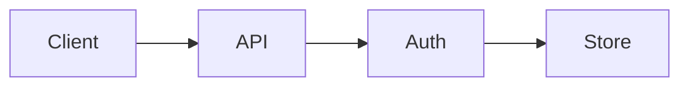

# System Architecture

This document describes the high-level architecture of the sample integration repository.

## Components

| Layer | Responsibility |
|-------|----------------|
| Auth | Token validation middleware |
| API | HTTP handlers and business logic |
| Frontend | React UI components |
| 1C | BSL processing and reports |

## Data flow

The auth middleware runs before handlers and rejects requests without credentials.

## Storage

Persistent data lives in relational tables; reports use SDBL query packages in `.dcs` files.
